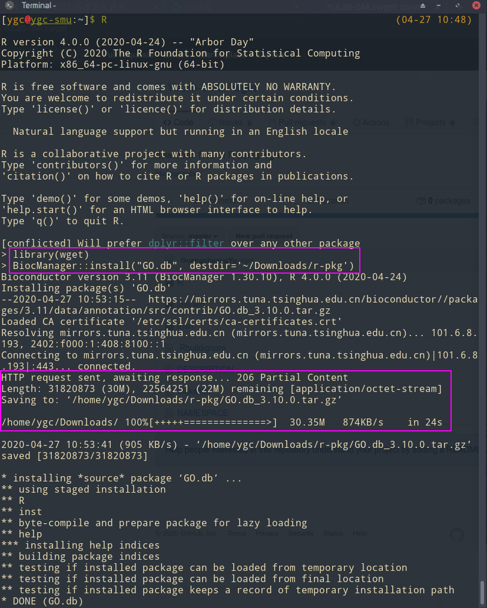

## wget: Setting Download Method to "wget -c"

Loading this package will change the default behavior of 'download.file'. The download method will be changed to using "wget -c" so that continued downloading will be supported. User can run 'wget_unset()' to disable it.

----

What you need is to load the package by `library(wget)`. Then `download.file()`, `install.packages()` and `BiocManager::install()` will all support continue retrival.

see also <https://mp.weixin.qq.com/s/z2ceLeSel1m8uxuNb1px3g> (in Chinese).

